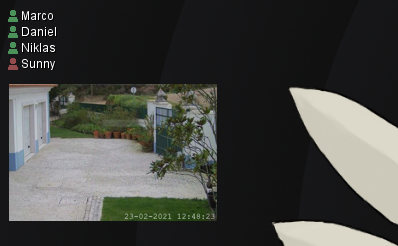

# SmartHome Addon
An addon that adds a module to see who is currently connected to the home network and to display a surveillance camera feed via motion detection.<br>



### Camera controls
You can right click on the camera image to move it around and scroll to zoom in and out.<br>


## Installation
This addon requires the core application [DesktopModules](https://github.com/LabyStudio/desktopmodules)

You can download the addon jar file [here](https://github.com/LabyStudio/smarthome-addon/releases/) <br>
Put the built jar file into the following directory: ``C:/Users/<name>/AppData/Roaming/DesktopModules/addons/``<br>
And then you are ready to launch the core application.

## Configuration example
```json
{
  "modules": {
    "homeindicatormodule": {
      "filter": [
        {
          "deviceNames": [
            "OnePlus-Daniel",
            "MyComputer123"
          ],
          "nickname": "Daniel"
        },
        {
          "deviceNames": [
            "Niklas-iPhone",
            "Niklas-Macbook"
          ],
          "nickname": "Niklas"
        }
      ]
    },
    "surveillancecameramodule": {
      "enabled": true,
      "x": 1664,
      "y": 293,
      "mjpeg_url": "http://127.0.0.1/cgi-bin/CGIStream.cgi?cmd=GetMJStream&loginstuff",
      "view": {
        "zoom": 130,
        "offset_x": -82,
        "offset_y": -52,
        "intervalInSeconds": 3
      },
      "motion_detection": {
        "enabled": true,
        "url": "http://127.0.0.1/cgi-bin/CGIProxy.fcgi?cmd=getDevState&loginstuff",
        "intervalInSeconds": 3,
        "trigger_condition": {
          "character_offset": 149, // The offset of the byte below in the motion detection response
          "character_byte": 49 // Required character (as byte) to detect a motion
        }
      }
    }
  },
  "fritzbox": {
    "address": "fritz.box",
    "password": "admin123"
  }
}
```

## Run in IDE
Launch the main class ``StartSmartHome``